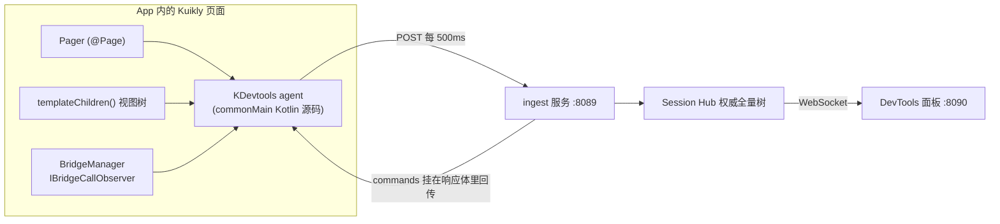

# Kuikly DevTools 原理说明

本文补充 [README.md](README.md) 中没有展开的实现细节，面向需要排查接线、理解插桩边界或修改 agent 的开发者。

## 一、数据从哪里来

Kuikly DevTools 的大部分能力来自 Kuikly 已有的公开 API 和 bridge observer。自动挂载、读取私有成员变量和重定向 `println` 需要编译期插桩；同步 Native 返回值在运行时拦截 `NativeBridge.toNative`。

| 能力 | 来源 | 是否需要插桩 |
| --- | --- | --- |
| 节点树 | `ViewContainer.templateChildren()` | 否 |
| 节点 id | `AbstractBaseView.nativeRef` | 否 |
| 属性 | `Props.copyPropsMap()` + `FlexNode` 布局样式（`margin` / `padding` / `width` / `flex` 等） | 否 |
| 页面绝对坐标 | `AbstractBaseView.frame` + `convertFrame(frame, null)` | 否 |
| Scroller 偏移 | `ScrollerView.curOffsetX/Y`（节点字段 `so`） | 否 |
| 日志 | `BridgeManager` 的 `IBridgeCallObserver` → `KRLogModule` | 否 |
| 网络请求 | bridge observer → HTTP、TDF `network.fetch`、长连接模块 | 否 |
| 原生模块调用（入参 / 异步回调） | bridge observer → `CALL_MODULE_METHOD` / `CALL_TDF_MODULE_METHOD`（解开 TDF 包装）+ `FIRE_CALLBACK` | 否 |
| 同步 Native 返回值 | 拦截 `NativeBridge.toNative` 的返回值（JS 包 prototype 上的 `toNative`；Android / Native iOS / 鸿蒙包平台 delegate） | **是**（运行时接线，不按方法名改写） |
| 长连接推送 | `UPDATE_INSTANCE` pager 事件 | 否 |
| 请求/回包关联 | `FIRE_CALLBACK` 的 `callbackId` | 否 |
| 上报通道 | Kuikly `NetworkModule.httpRequest` | 否 |
| 定时采样 | Kuikly 的 `setTimeout(pagerId, ms) {}`（默认 500ms） | 否 |
| 自动挂载到 `@Page` | 改写页面类 | **是** |
| 读取私有成员变量 | 在属主类体内生成 dumper | **是** |

Kuikly 的 `attr { }` 分成两条存储路径，只读其中一条会漏属性：

- 渲染样式（`backgroundColor`、`opacity`、`text`、`border`…）写入 `Props.propsMap`，`copyPropsMap()` 能拿到
- 布局样式（`margin`、`padding`、`width`、`flex`、`flexDirection`…）只写入 `FlexNode`，**不会**进 `propsMap`

agent 会把 FlexNode 上的非默认布局值合并进节点的 `p`，因此面板里的「属性」同时包含两条路径。`top` / `left` / `bottom` / `right` 写在 `FlexNode.stylePosition` 上，Kuikly 只公开了 setter；agent 用编译器 visibility suppress 读取这个 `internal` getter（与 `LayoutImpl` 同一入口）。

`BridgeManager` 的 observer 钩子会收到每一次 Kotlin 与 Native 之间的调用，这也是日志和网络能力不需要改写业务调用点的原因：

- `KLog`（`TMLog` 的底层实现）调用 `KRLogModule`
- `HttpClient.ajax` 调用 `KRNetworkModule.httpRequest`（采集 `param` 请求体和 `headers` / `cookie`）
- `HttpService`、`httpGet`、`httpPost` 和 `RoutePolling` 通过 `KuiklyTDFModule.asyncCall("network", "fetch")`（采集 `body` 和 `headers`）
- `fetchMapServer` 通过 `TMKuiklyJCENetworkModule.asyncCallWithBinary`，鸿蒙实现使用对应的 TDF 调用
- 长连接订阅经过 `TMLongLinkModule.subscribe/observe`，推送以 pager 事件到达；QMLink 和 MQTT 走各自的 Module 回调
- 所有异步回包通过 `callKotlinMethod(FIRE_CALLBACK, pagerId, callbackId, data)`，agent 用 `callbackId` 关联请求与响应
- 其它 `CALL_MODULE_METHOD` / `CALL_TDF_MODULE_METHOD`（`BridgeModule`、`KuiklyTDFModule.asyncCall("CalendarModule", …)`、`NotifyModule` 等）进入原生调用面板；日志 / HTTP / 长连接 / MQTT / `KRVsyncModule` 除外（含 `network.getCookie`、`TMNetworkModule.cancel` 等）
- 同步 `toNative` 的立即返回值通过拦截 `NativeBridge.toNative` 统一采集（含 klib 里的 `CalendarModule.get` 等）；observer 仍在调用前触发

Native 和 JS 运行时没有 `kotlin-reflect`。因此，要读取 `private` 字段，读取代码必须生成在字段所属类的类体内部；这正是改写器存在的主要原因。

## 二、端到端数据流



设备端每次采样都会遍历视图树，但只上传序列化结果发生变化的节点和已删除的 id。服务端 Session Hub 合并 delta 并维护权威全量树，因此面板稍后连接也能拿到完整快照。命令放在 ingest 的 HTTP 响应体中返回，一次请求完成设备上报和面板下发，不需要第二条设备通道。

日志、网络记录和原生调用在设备侧先进入环形缓冲区，批量随 ingest 请求发送；服务端按页面生命周期保存记录。页面销毁时 agent 发送 `DESTROY_INSTANCE`，服务端才清理这一页的归档。

## 三、插桩改写

### 改写位置和行号

Gradle init script 把目标模块的 `commonMain` 复制到 `build/kuikly-devtools/instrumented`，改写副本，再把 `commonMain.kotlin.srcDirs` 指向副本。业务源码目录不会被修改。

改写器使用 `kotlin-compiler-embeddable` 做 PSI 解析，但只使用解析器，从不调用编译器。它按源码 offset 插入代码，且不新增换行，所以插桩副本与原文件保持一致的行号，崩溃堆栈和 IDE 跳转仍然可用。改写器内嵌的 Kotlin 版本与业务工程的编译版本解耦，同一个 jar 可以服务移动端和鸿蒙链路。

### 四条改写规则

#### 1. `@Page` 类注入挂载

```kotlin
@Page("DevToolsTestPage", supportInLocal = true)
internal class DevToolsTestPage : BasePager() {
    // ... 原有内容不变 ...
    init { KDevtools.attachPager(this, "DevToolsTestPage") }
}
```

挂载代码放在类体末尾，保证页面的属性初始化器先完成，再启动采样和 bridge 监听。

#### 2. 组件类注入状态 dumper

`ComposeView`、`ComposeAttr` 和 `Pager` 的子类会在类体末尾追加注册代码。示例：

```kotlin
init {
    KDevtools.registerState(this) {
        val __kdtState = LinkedHashMap<String, Any?>()
        KDevtools.tryPut(__kdtState, "selectedTabForward") { this.selectedTabForward }
        KDevtools.tryPut(__kdtState, "selectedDirection") { this.selectedDirection }
        KDevtools.tryPut(__kdtState, "scrollerRef") { this.scrollerRef }
        __kdtState
    }
}
```

实现约束：

- 代码位于属主类体内，因此可以直接读取 `private`，不依赖反射
- 每个字段使用独立的受保护 lambda；未初始化的 `lateinit` 或抛异常的 getter 只会让该字段显示为不可读，不会让整个 dump 失败
- 基类采用传递识别，间接继承 `ComposeView` 的业务类也会被处理
- 父类和子类分别注册，`registerState` 追加而不是覆盖，因此继承字段也能显示
- 只读取类体内直接声明的属性和主构造器中的 `val`/`var` 参数；`companion object`、嵌套类、扩展属性和 `const val` 跳过

状态是按需读取的：面板打开某个节点后才下发 dump 命令，避免每个采样周期序列化整棵树的全部状态。读取 `by observable(...)` 属性不会污染响应式依赖图，因为 `ReactiveObserver.notifyGetValue` 只有在依赖收集阶段才记录属性读取，而 dump 回调不在该阶段运行。

#### 3. 顶层 `println(x)` 重定向

`println` 是唯一不经过 bridge 的日志路径，因此改写器把单参数的顶层 `println(x)` 替换为 `KDevtools.printLine(x)`。`TMLog` 和 `KLog` 已经会被 bridge observer 捕获，不改写它们，否则会重复计数。

以下调用不会改写：`stream.println(x)`、无参 `println()`、带尾随 lambda 的调用，以及位于已发布 klib 中的代码。

#### 4. 同步 Native 返回值（统一拦截 `toNative`）

bridge observer 在 `toNative` **之前**触发，看不到返回值。所有 Kotlin → Native 同步调用（业务 `syncCall`、官方 `CalendarModule.get`、klib 内部实现）最终都走 `NativeBridge.toNative`，因此在这一层接返回值，而不是按模块/方法名逐个改写：

- **Kotlin/JS**（`npx kuikly-devtools build-js`）：包 `NativeBridge.prototype.toNative`（含 mangled 名 `toNative_*`）。不要只包 `registerCallNative`：UMD/`$jsExportAll$` 会写回原函数，实例 `callNativeCallback` 又是懒加载
- **Android / Native iOS / 鸿蒙**：Gradle 改写生成的 `KuiklyCoreEntry`，在 `registerNativeBridge` 之后包平台 delegate

改写器不改业务里的 `syncCall` / `toNative`。`asyncCall` 也不改写。

每次改写会在目标工程的 `build/kuikly-devtools/instrumentation-report.md` 生成清单，例如：

```text
instrumented 62/128 files: 3 pages, 72 stateful classes, 225 println call sites
pages: TDHotReloadTestPage, DevToolsTestPage, RealtimeItemDetailPage
```

## 四、Gradle 接入链路

`gradle/devtools.init.gradle` 使用 Groovy，而不是 Kotlin DSL。init script 的 classpath 没有 Kotlin Gradle Plugin，无法安全地引用 `KotlinMultiplatformExtension`；使用动态派发可以兼容不同 Kotlin/KGP 版本。

在每个应用 KMP 插件的工程中，脚本会在 `afterEvaluate` 阶段：

1. 判断目标模块。默认选择 `commonMain` 中包含 `@Page(` 的 KMP 模块，也可以通过 `--modules` 指定
2. 生成 `KDevtoolsConfig.kt`，把 host、port、sampleMs 固化为编译期常量
3. 注册 `instrumentKuiklySources` 任务
4. 将 `commonMain.kotlin.srcDirs` 重定向为插桩副本、生成目录和 agent 运行时源码
5. 让所有 `compile*` / `ksp*` 任务依赖插桩任务

所以：

```bash
npx kuikly-devtools gradle -- :sampled:compileKotlinJs
```

等价于从工程根目录调用 `./gradlew :sampled:compileKotlinJs`，但 CLI 额外传入 init script 和 `-Pkuikly.devtools.*` 属性。它只执行指定的编译任务；`build-js` 则只是把默认任务设为 `packLocalJSBundleDebug`，`build-apk` 把默认任务设为热重载 APK 任务。三种构建命令都会先启动 DevTools 服务，若对应 ingest 和面板服务均已运行则直接复用。

运行时 agent 以源码形式加入 `commonMain`，而不是发布 klib。发布 klib 需要为每个 Kotlin 版本和每个 target 维护不同产物并处理 ABI；源码由业务模块自行编译，能自动适配 Android、iOS、JS 和鸿蒙目标。

### 增量缓存隔离

Kotlin 增量缓存按源码绝对路径索引。插桩构建使用另一份源码根，如果普通构建和插桩构建共用 `build/kotlin`，编译器可能同时看到两份同名声明，产生 `Redeclaration` 或 internal compiler error，并污染后续普通构建。

因此 init script 会在插桩构建前后清理目标模块的 Kotlin 增量目录：

```groovy
gradle.buildFinished {
    icDirsToClean.each { File dir -> if (dir.exists()) dir.deleteDir() }
}
```

代价是切换模式时可能触发一次全量编译，收益是普通构建与插桩构建不会互相污染。若中途终止 Gradle 导致清理没有执行，可手动删除对应模块的 `build/kotlin`。

## 五、设备可达性和资源开销

Android 默认通过 `adb reverse tcp:8089 tcp:8089` 访问本机；iOS 和鸿蒙使用编译期写入产物的局域网地址。agent 运行时先试 `127.0.0.1`，失败后退回该局域网地址并缓存成功地址。明文 HTTP 访问内网地址需要 debug 包允许 cleartext traffic。

设备每个采样周期遍历一次树，只发送发生变化的节点。日志、网络记录和原生调用默认每 1.5s 批量发送，或者在批次较大时提前发送；空闲页面不会因为单独一条日志就立即 POST，但会每 5s 发送一个空心跳，满足 8s 内至少一次。服务端 10s 未收到任何 ingest 数据时自动移除会话，作为页面突然退出的兜底。Live 截图只在树变化后调用 `Pager.toImage`，最多每 2s 一帧，并在标签页或预览不可见时暂停。

设备侧最多缓冲 2000 条日志、500 条网络记录和 500 条原生调用，服务端每页最多保留 20000 条日志、2000 条网络记录和 2000 条原生调用。成员变量只对面板当前展开的节点按需 dump。

## 六、已知边界

- 已发布 klib 中的组件可以显示节点和 props，但无法读取私有成员
- 同步 Native 返回值通过拦截 `NativeBridge.toNative` 统一采集。鸿蒙走 Kotlin Delegate、不经过 bridge 的 TDF 调用仍然可能看不到入参行
- `BridgeManager.addCallObserver` 按 pagerId 只保存一个 observer，挂载 agent 会替换同一页面上的其它 observer
- 打开节点会读取其 `by lazy` 属性，因此可能触发该属性初始化
- 树是采样数据，两次 tick 之间出现又消失的变化不会被记录
- 截图依赖 Kuikly 2.17+ 的 `DeclarativeBaseView.toImage`；虚拟节点没有 `renderView`，不能单独 Capture node
- 截图点选使用可视坐标（布局 `f` − 祖先 `ScrollerView` 的 `so`，再叠 `p.transform`）。不是 `ScrollerView` 子类的自定义滚动容器没有 `so`，点选仍可能偏差
- 插桩源码是副本；行号与原文件一致，但修改副本不会影响下一次构建
- `SliderAttr.padding` 覆盖了容器 padding 且不写回 FlexNode，因此滑块的 padding 不会出现在 `p` 里
