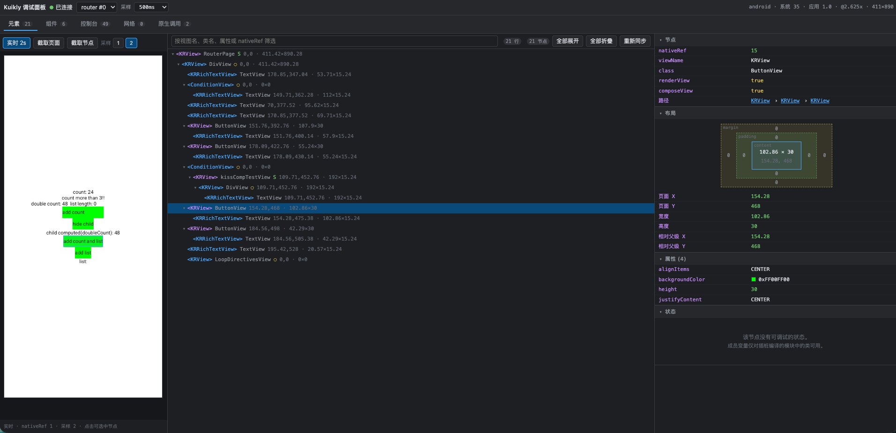
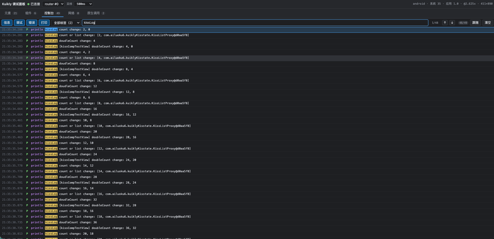

# Kuikly DevTools

> English: [README-EN.md](README-EN.md) ｜ 原理详解：[ARCHITECTURE.md](ARCHITECTURE.md) ｜ 协议细节：[PROTOCOL.md](PROTOCOL.md)

给 Kuikly（Kotlin Multiplatform）页面用的类 Chrome DevTools 调试面板。页面跑在真机上，浏览器里实时看到节点树、属性与布局、组件成员变量、日志和网络请求。

插桩是**可选开关**。不带开关时构建产物与今天完全一致：业务源码一行不改，不新增任何依赖，插桩代码不可能进入发布产物。

## 最基础用法

在 Kuikly 业务工程根目录（能找到 `gradlew`）执行下面其中一条命令即可。

```bash
# iOS：编译支持调试的 JS 产物，并启动 DevTools server 和调试面板
npx kuikly-devtools dev

# Android：编译支持调试的热重载 APK，并启动 DevTools server 和调试面板
npx kuikly-devtools build-apk
```

两条命令都会在构建成功后打印调试面板地址（默认是 `http://localhost:8090`）。在浏览器打开这个地址，再在设备上打开或刷新页面，即可查看节点树、组件状态、日志和网络请求。

### 效果预览

Elements：节点树 + Live 截图，点选截图可命中树上对应节点。



Console：按级别 / tag / 关键字过滤，自动滚动。



---

## 一、常用命令

```bash
npx kuikly-devtools serve       # 只起服务，不构建
npx kuikly-devtools doctor      # 体检：路径、端口、网卡、adb 状态
npx kuikly-devtools build-js    # 启动或复用服务，再插桩打 JS Bundle
npx kuikly-devtools build-apk   # 启动或复用服务，再插桩打热重载 APK
npx kuikly-devtools gradle -- :sampled:packLocalJSBundleDebug  # 启动或复用服务，再执行任意 Gradle 任务
npx kuikly-devtools inspect sessions  # 为 AI 或命令行按需检索已连接页面
```

最后一条命令适合自己指定 Gradle 任务：

- `npx kuikly-devtools gradle` 调用 CLI 的 `gradle` 子命令。CLI 会找到当前目录（或 `--project` 指定目录）下的 `gradlew`，并注入 DevTools 的 init script 和连接参数，因此这次构建会启用源码插桩。
- `--` 是参数分隔符；它后面的内容原样传给 Gradle。除了任务名，也可以放 `--info`、`-x test`、`-Pkey=value` 等 Gradle 参数。
- `:sampled` 是 Gradle 项目路径，表示 `sampled` 模块；`packLocalJSBundleDebug` 是该模块的 JS Bundle 调试构建任务。需要只编译 Kotlin/JS，或执行其他模块任务时，可以把它替换成对应的 Gradle task；命令会和其他构建命令一样启动 DevTools 服务，已运行时直接复用。

这条命令适合快速验证指定模块能否通过插桩构建。也可以直接使用 `npx kuikly-devtools build-js` 生成默认 JS Bundle，或使用 `npx kuikly-devtools build-apk` 生成 Android 调试 APK。运行前请确认工程有 `gradlew`，且改写器已构建（源码开发时先执行 `npm run build:instrumentor`）。

### AI 页面检索 Skill

npm 包内置 `kuikly-page-inspect` Skill，供 Codex、Claude Code 与 Cursor 在排查 UI、日志和网络问题时按需读取**正在运行**的 Kuikly 页面信息。它不读取全量页面快照，先通过分页检索定位所需记录，避免大页面、长日志和接口 body 膨胀 AI 上下文。在业务工程根目录执行一次即可为三个客户端创建项目级入口：

```bash
npx kuikly-devtools init-skill
```

- Codex：`.codex/skills/kuikly-page-inspect/SKILL.md`
- Claude Code：`.claude/skills/kuikly-page-inspect/SKILL.md`
- Cursor：`.cursor/skills/kuikly-page-inspect/SKILL.md`

默认不会覆盖已有的项目自定义 Skill；需要用包内版本重新生成时执行 `npx kuikly-devtools init-skill --force`。包内权威源文件为 [`skills/kuikly-page-inspect/SKILL.md`](skills/kuikly-page-inspect/SKILL.md)。

先确保已用 `dev`、`build-js`、`build-apk` 或 `gradle -- <task>` 启动/复用服务，并在设备上进入目标页面。AI 或终端从会话列表开始，再执行针对性的查询：

```bash
# 1. 获取已连接页面，选择 pagerId
npx kuikly-devtools inspect sessions

# 2. 只检索匹配的日志、网络或节点；默认每页最多 50 条
npx kuikly-devtools inspect logs --pager 7 --query timeout
npx kuikly-devtools inspect network --pager 7 --query /api/search --status 500
npx kuikly-devtools inspect nodes --pager 7 --query SearchBar

# 3. 找到 ID 后再取单条详情
npx kuikly-devtools inspect network-detail --pager 7 --id cb_42
npx kuikly-devtools inspect log-detail --pager 7 --id 42
npx kuikly-devtools inspect node-detail --pager 7 --id 42
```

`logs` 支持 `--level`、`--tag`；`network` 支持 `--status`、`--kind`；所有列表支持 `--limit`（默认 50，最大 200）和 `--offset` 分页。检索结果只返回摘要、属性键与请求/响应预览。返回 JSON 不超过 15 KiB 时直接返回原数据；只有单条详情严格超过 15 KiB，CLI 才会把完整 JSON 写到**业务项目根目录**的 `.kuiklyPageTemp/`，终端仅返回 `savedTo` 路径；AI 应只读取该文件需要的字段或片段，不能直接将完整文件注入上下文。该目录已被 Git 忽略，调试后可手动删除，或执行：

```bash
npx kuikly-devtools inspect clean-temp
```

### 参数

| 参数 | 默认值 | 说明 |
| --- | --- | --- |
| `--host <ip>` | 自动探测 | 编译期写进产物的局域网地址 |
| `--port <n>` | `8089` | ingest 端口（设备 → 本机） |
| `--panel-port <n>` | `8090` | 面板端口（浏览器访问） |
| `--sample <ms>` | `500` | 初始采样间隔 |
| `--project <dir>` | 最近的 `gradlew` | Gradle 工程根目录 |
| `--modules <paths>` | 自动 | 指定要插桩的 Gradle 模块路径，逗号分隔 |
| `--task <name>` | 按命令 | 覆盖 `build-js` / `build-apk` 用的任务 |
| `--debug` | 关 | 打印 ingest 地址、局域网地址和 `adb reverse` 连接详情 |
| `--copy-only` | 关 | 只做源码重定向、不改写（用来隔离接线问题） |
| `--no-adb` | 关 | 不尝试建立 reverse 隧道 |

要让某个文件不被插桩，在文件里任意位置写一行注释 `kuikly-devtools:ignore` 即可。

---

## 二、四个面板

### Elements

节点树来自 `ViewContainer.templateChildren()`，也就是 DSL 结构，不是原生 view 树，因此虚拟容器和 `ComposeView` 边界也能看到。Inspector 可查看节点信息、布局、全部 props、按需读取的成员变量和 Live 截图。

树上的视觉约定：紫色标签表示 `ComposeView`，蓝色标签表示普通节点，`◌` 表示没有对应原生 view 的虚拟节点，`S` 表示有可 dump 的成员变量。节点后面的 `x,y · w×h` 是相对页面根节点的**布局**坐标（`convertFrame`）。成员变量按需拉取，只有点开节点时才会通知设备 dump，避免每帧序列化整棵树的状态。Live 截图在树变化时才调用 `toImage`，最多每 2s 一帧；点击截图会按**可视**坐标命中节点（布局框减去祖先 Scroller 的 `contentOffset`，再叠 `transform`，并按 overflow 裁剪）。重叠时按绘制顺序：`zIndex`、后声明的兄弟、子节点；铺满全屏但不绘制自身的 overlay 会把空白处透传下去，避免挡住下面的页卡。

### Components

只列 `Pager` 和 `ComposeView` 节点，适合按组件定位页面内容。

### Console

按级别（info / debug / error / println）、tag、关键字过滤并自动滚动。tag 会从 `KLog` 的 `[KLog][tag]:message` 格式中反解；设备侧缓冲溢出时会显示 `N dropped`，不会静默丢弃。

### Network

展示 HTTP（`KRNetworkModule`、TDF `network.fetch`、`TMNetworkModule.fetchMapServer`）及长连接请求（`TMLongLinkModule`、QMLink、MQTT）。选中请求可查看请求头、请求体、Response、状态码、耗时和 `callbackId`；普通 HTTP（`KRNetworkModule` / `network.fetch`）可一键复制为 curl。请求发出时先显示 `pend`，回包后补齐状态和耗时；长连接推送会单独列出 Frames。

日志和网络请求以 serve 端为权威存档。设备上报成功后本地缓冲会清掉，但服务端会保留；只有 Kuikly 页面销毁（`DESTROY_INSTANCE`）时，该页数据才会删除。

---

## 三、工作原理概览

设备端 agent 通过 Kuikly 的公开视图 API 和 bridge observer 采集节点树、属性、布局、日志及网络请求；CLI 只在需要调试的那次 Gradle 构建中注入 init script，把 agent 挂到 `@Page`，并为源码类生成私有成员变量 dumper。设备把变化上传到 ingest 服务，浏览器面板通过 WebSocket 查看服务端维护的会话数据。

原理、数据流、插桩规则、Gradle 接入和缓存隔离的详细说明见 [ARCHITECTURE.md](ARCHITECTURE.md)。

---

## 四、设备可达性

| 平台 | 设备怎么连到本机 |
| --- | --- |
| Android | `adb reverse tcp:8089 tcp:8089`，CLI 自动建立，设备上报到 `127.0.0.1` |
| iOS | 编译期写进产物的局域网地址 |
| 鸿蒙 | 同上 |

运行时先试 `127.0.0.1`，失败再退到编译期的局域网地址，成功后锁定并缓存。明文 HTTP 访问内网地址需要 debug 包允许 cleartext traffic。

---

## 五、开销与边界

设备每个采样周期走一遍树，只发序列化结果变化过的节点和消失的 id；完全空闲的页面不会发送数据。成员变量只 dump 面板当前展开的节点，Live 截图只在树变化后采集，最多 2s 一帧。采样间隔可以在面板顶栏改（100ms ~ 5s），或者构建时用 `--sample` 指定。

只有被插桩模块里的源码可以读取私有成员；已发布 klib 中的组件只能看到节点和 props。`BridgeManager.addCallObserver` 每个 pagerId 只保存一个 observer，挂载 agent 会替换同一页面上的其它 observer。展开节点会读取其 `by lazy` 属性，可能触发初始化。树是采样的，不是逐帧录制；截图依赖 Kuikly 2.17+ 的 `DeclarativeBaseView.toImage`，虚拟节点不能单独截图。插桩后的源码是副本，行号与原文件一致，但修改副本没有意义。

---

## 六、排查手册

**面板提示 `panel bundle is missing`**：在 devtools 仓库执行 `npm run build:ui`。

**Gradle 提示 `instrumentor jar missing`**：执行 `npm run build:instrumentor`。临时只验证接线可以加 `--copy-only`，但这样拿不到成员变量和 `println`。

**面板一直显示 `Waiting for a Kuikly page`**：确认构建日志出现 `[kuikly-devtools] instrumented N files: M pages`，设备日志出现 `attached ... -> host:port`，并检查 Android 的 `adb reverse`、iOS/鸿蒙的局域网连通性和 debug 明文 HTTP 配置。

**端口被占用**：换端口用 `--port` / `--panel-port`；`--port` 会写进产物，所以修改后要重新构建。

**切回普通构建时报 `Redeclaration` 或 internal compiler error**：通常是中途终止 Gradle 导致缓存清理没有执行。手动清理对应模块的 `build/kotlin` 后再构建，例如：

```bash
rm -rf sampled/build/kotlin
```

**鸿蒙链路构建失败**：先不带插桩运行 `./gradlew -c settings.ohos.gradle.kts :sampled:compileKotlinJs`，确认是否为原有依赖或环境问题。

---

## 七、二次开发

如果要修改 DevTools 本身，再从源码安装并构建：

```bash
git clone https://github.com/ailuoku6/kuikly-devtools.git
cd kuikly-devtools
npm install
npm run build
```

`npm run build` 会生成插桩改写器 jar 和调试面板静态资源；完成后可在任意 Kuikly 工程中使用上面的 `npx kuikly-devtools dev` 或 `npx kuikly-devtools build-apk`。

```bash
npm install
npm test
npm run build:instrumentor
npm run build:ui
```

没有设备时，可用 <http://localhost:8090/?mock=1> 或 `npm run simulate` 开发和验证面板。协议格式见 [PROTOCOL.md](PROTOCOL.md)。

### 发布到 npm

此仓库使用 npm Trusted Publisher：在 npm 包的 Trusted Publisher 设置中，将 GitHub owner/repository、工作流文件 `.github/workflows/publish.yml` 与发布环境（留空）配置为与本仓库一致。无需在 GitHub Actions Secrets 中配置 `NPM_TOKEN`。把 `package.json` 的 `version` 改到要发的版本后打 tag 推送即可：

```bash
git tag v0.1.3
git push origin v0.1.3
```

tag 必须是 `v` + `package.json` 里的版本号，GitHub Actions 会跑测试、构建插桩 jar 和面板，并通过 GitHub OIDC 执行 `npm publish`。
